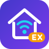

<p align="center">
  
</p>

# homebridge-mqttthing-ex

[](https://github.com/tasict/homebridge-mqttthing-ex)
[](https://www.npmjs.com/package/homebridge-mqttthing-ex)

A [Homebridge](https://homebridge.io) plugin supporting a wide range of HomeKit
services over MQTT — a modern, actively maintained successor to
[homebridge-mqttthing](https://github.com/arachnetech/homebridge-mqttthing).

## Highlights

- **Drop-in replacement** — your existing `config.json` works unchanged.
  Accessory entries keep using `"accessory": "mqttthing"`.
- **Platform mode** — an optional second way to configure the same devices:
  one config block, one shared MQTT connection per broker, and a stable
  per-device identity so renaming a device no longer matters to HomeKit.
  Moving a device there preserves its rooms, scenes and automations.
- **Homebridge v2 ready** — TypeScript, ES modules, modern HAP APIs
  (`onGet`/`onSet`), works on Homebridge 1.8+ and 2.x.
- **Device protection** — optional outbound publish queue with throttling and
  message coalescing, so HomeKit scene bursts and slider drags cannot overwhelm
  low-power IoT devices.
- **Full codec & apply compatibility** — existing CommonJS codec files and
  `{ "topic": ..., "apply": ... }` expressions keep working as before.

## Migration from homebridge-mqttthing

1. Uninstall `homebridge-mqttthing` (both plugins register the accessory name
   `mqttthing`, so they cannot be installed at the same time).
2. Install `homebridge-mqttthing-ex`.
3. Restart Homebridge. **No configuration changes are required.**

**No HomeKit re-pairing is needed.** Homebridge identifies a bridged
accessory by the accessory alias plus its configured name
(`uuid.generate("mqttthing:" + name)`), not by the plugin package name.
Since this plugin registers the same `mqttthing` alias and your accessory
names stay the same, every accessory keeps its UUID — room assignments,
automations, and scenes are all preserved. To make the switch seamless:

- Perform steps 1-3 as one operation with a **single restart**. If
  Homebridge runs without the plugin in between, the accessories disappear
  from the bridge and iOS may drop them from automations after syncing.
- Do not rename accessories during the migration (the `name` is part of the
  accessory identity, as it always was).
- If you run mqttthing accessories in a child bridge (`_bridge`), keep the
  same `_bridge.username` and the pairing is preserved too.

## Platform mode

Accessory mode (`accessories[]`) is the format inherited from
homebridge-mqttthing and is fully supported — nothing about it changes.
Platform mode is an alternative that puts every device in one block:

```json
{
  "platforms": [
    {
      "platform": "mqttthing",
      "name": "MQTT Thing",
      "url": "mqtt://broker:1883",
      "username": "user",
      "password": "secret",
      "devices": [
        {
          "id": "Living Room Light",
          "name": "Living Room Light",
          "type": "lightbulb",
          "topics": { "setOn": "home/light/set", "getOn": "home/light/state" }
        },
        {
          "id": "a3f92c81d04b57e6",
          "name": "Garage Sensor",
          "type": "contactSensor",
          "url": "mqtt://other-broker:1883",
          "topics": { "getContactSensorState": "garage/door" }
        }
      ]
    }
  ]
}
```

What it gives you:

- **One MQTT connection per broker** instead of one per device. Devices
  sharing the same effective broker settings share a connection; a device
  overriding `url`, `username`, `password` or `mqttOptions` gets its own.
  With a child bridge, the whole platform runs in one child process rather
  than one per device.
- **Accessory caching** — devices appear in HomeKit at startup, before the
  broker is reachable.
- **A stable identity** — the optional `id` decides the HomeKit accessory,
  so a device can be renamed freely.
- **Start-up validation** — configuration problems are reported in the log.

A device entry is exactly an accessory block without `"accessory"`, plus the
optional `"id"`. Broker settings given on the block are defaults that any
device can override.

### Moving accessories to platform mode

Open the plugin settings in the Homebridge UI and follow **About platform
mode** at the bottom of the accessory list. It explains what changes and what
does not, and leads to a screen where you pick which accessories to move —
each one shows up front whether it can be moved. A single accessory can also
be moved from its own editor, under **Platform mode**.

Nothing is written until you press **Save all changes** at the top of the
page; then restart Homebridge. While platform changes are pending, the
Homebridge UI's own Save button is greyed out, because it would only save
part of the configuration.

**No HomeKit re-pairing is needed.** The accessory UUID is generated from
`uuid.generate("mqttthing:" + (id || uuid_base || name))`, which is the same
formula Homebridge uses for accessory blocks. Migration pins `id` to what the
device is identified by today — its `uuid_base` if set, otherwise its name —
so the UUID does not change and rooms, scenes and automations are preserved.
Afterwards the `name` is only a display name and can be changed at will.

Notes:

- Do not configure the same device in both `accessories[]` and `devices[]`.
  Homebridge publishes the accessory and skips the platform copy; the plugin
  warns about it in the log, and the UI flags both entries.
- The `id` is written once, when a device is created or migrated. Changing it
  later makes HomeKit treat the device as new, which is why the UI only
  allows it through "Edit as JSON" with an explicit confirmation.
- There is no automatic way back. To return a device to accessory mode, move
  its entry into `accessories[]` in config.json and restore
  `"accessory": "mqttthing"` (drop `id` only if it equals the name).
- **Accessories running in their own child bridge are the one exception to
  the no-re-pairing guarantee.** Homebridge supports `_bridge` on whole
  accessory and platform blocks, not on individual platform devices, so such
  an accessory cannot keep its own child bridge. Each child bridge is paired
  separately in HomeKit, so removing one means pairing it again. The UI
  therefore refuses to move these accessories and says why; move the whole
  platform into a child bridge instead (add `_bridge` to the platform block
  by hand — the Homebridge UI does not offer child-bridge management for
  platform blocks here, because this plugin's configuration schema describes
  accessory blocks).
- On a shared connection the last-will message names the platform rather than
  a single device, and `logMqtt` on any device logs the received messages of
  every device on that connection.

## What's new compared to homebridge-mqttthing

- **Custom configuration UI** for the Homebridge UI: searchable accessory
  list built for setups with dozens of accessories, a type-aware editor with
  a topic table, `apply` function editing (the old schema form destroyed
  such configs), full support for the `custom` multi-service type, MQTT
  connection testing, and live topic probing.
- **Outbound publish queue** (`publishMinIntervalms`) with per-topic
  coalescing, protecting low-power devices from HomeKit command bursts.
- **Long-standing upstream bugs fixed**, including spurious color publishes
  at startup, adaptive lighting turning lights on, temperature range
  clamping of sensor readings, wildcard subscriptions, null-payload crashes,
  and history crashes with multiple services — see
  [docs/UpstreamIssues.md](docs/UpstreamIssues.md) for the complete list
  with upstream issue references.

## Documentation

- [Configuration](docs/Configuration.md)
- [Accessory types](docs/Accessories.md)
- [Codecs](docs/Codecs.md)
- [Upstream issues fixed](docs/UpstreamIssues.md)

## Status

This project is under active development. See the release notes for progress.

## License

Apache-2.0. This project is a ground-up rewrite of
[homebridge-mqttthing](https://github.com/arachnetech/homebridge-mqttthing)
by David Miller and contributors — see [NOTICE](NOTICE) for attribution.
